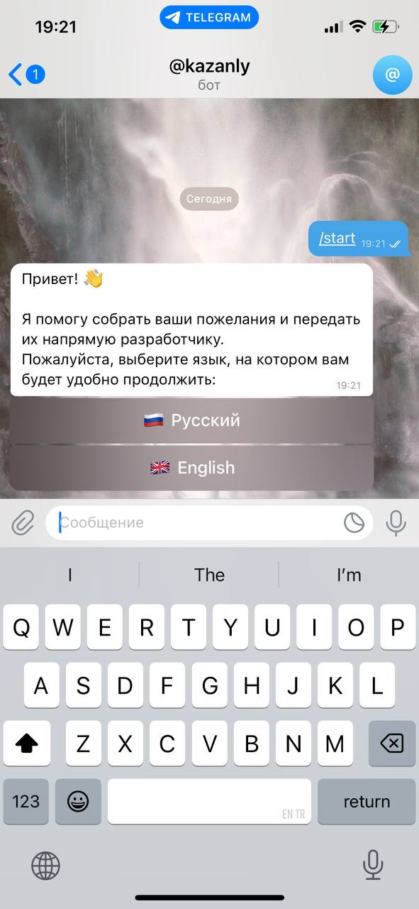
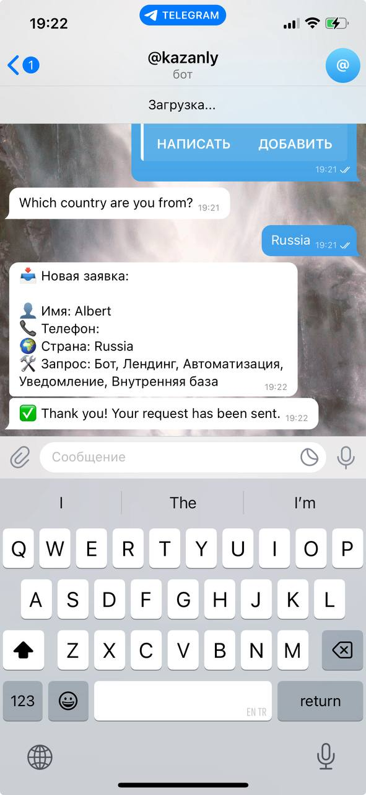
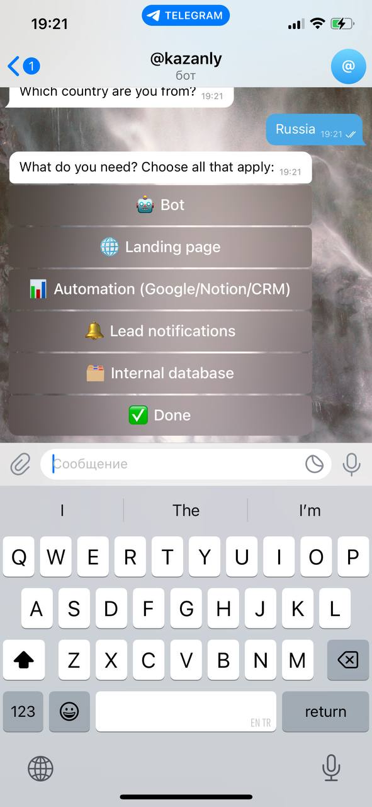

Lead Capture Telegram Bot
A simple Telegram bot that collects a user's name, phone number, country, and their selected options.
It saves the data to Google Sheets and sends a notification to the admin in Telegram.

✨ Features
Collects leads via step-by-step FSM flow

Multiselect option for service types (Bot / Website / Automation / CRM / Notifications / Database)

Sends data to a Google Sheet

Sends instant lead notification to admin in Telegram

Supports two languages: 🇬🇧 English / 🇷🇺 Russian

📁 Files
main.py — entry point of the bot

handlers.py — handles user messages and states

states.py — form steps using FSMContext

utils.py — helper functions (e.g. sending to Telegram & Google Sheets)

requirements.txt — project dependencies

🚀 How to Run
Clone the repo
git clone https://github.com/kazanly/telegram-leadbot.git

Install dependencies
pip install -r requirements.txt

Create a .env file with your tokens:

TELEGRAM_TOKEN=your_bot_token
GOOGLE_SHEET_ID=your_sheet_id
ADMIN_CHAT_ID=your_admin_chat_id
Run the bot
python main.py

🧠 Use Case
This bot is great for digital agencies and freelancers who want to capture leads via Telegram without using paid forms or CRM platforms.

